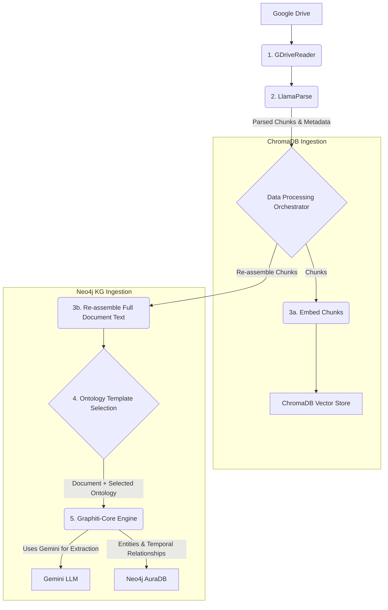
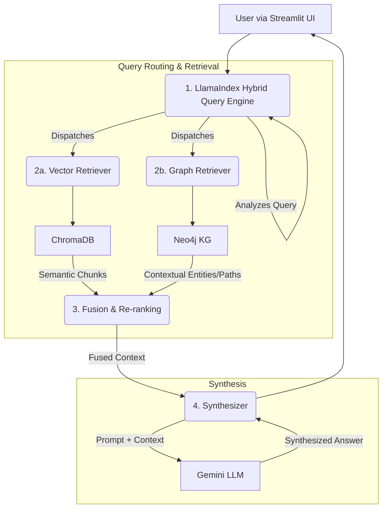

Of course. Here is the final, integrated Product Requirements Document,
combining the high-level architecture from the first version with the detailed
technical specifications and AI developer guidance from the second. This
document is designed to serve as a complete and actionable blueprint.

---

# **Technical PRD: Knowledge Graph & Hybrid RAG Enhancement**

**Version**: 3.0 (Integrated) **Date**: 2025-06-11 **Author**: Gemini
**Audience**: AI Pair Programmer / Development Team **Objective**: To provide a
detailed, actionable blueprint for an AI to generate a task list and implement
the next phase of the `kev-new-graph-rag` project.

## 1. Introduction & Project Goals

This document outlines the technical requirements for the next major phase of
the **kev-new-graph-rag** project. The current system successfully ingests
documents from Google Drive into parallel data stores: ChromaDB for vector-based
RAG and Neo4j for foundational graph storage.

The primary goal of this new phase is to evolve the Neo4j store into a rich,
interconnected, and temporally-aware **Knowledge Graph (KG)** and to build a
sophisticated **Hybrid Query Engine** that leverages both the semantic search
capabilities of ChromaDB and the contextual power of the new KG.

### Core Objectives:

1. **Implement Knowledge Graph Construction**: Utilize `graphitti-core` to
   process documents and extract entities and their relationships, enriching the
   Neo4j database beyond simple document nodes.
2. **Develop a Dynamic Ontology System**: Create a flexible system for managing
   relationship schemas ("Ontology Templates") that can be either user-selected
   or automatically suggested by an LLM.
3. **Build a Hybrid Query Engine**: Use LlamaIndex to orchestrate complex
   queries that retrieve and synthesize information from both the vector store
   (ChromaDB) and the knowledge graph (Neo4j).
4. **Enhance User Interface**: Implement graph visualization capabilities within
   the Streamlit UI and ensure the chat interface is fully functional with the
   new hybrid backend.
5. **Ensure bleeding-edge Model Compatibility**: Guarantee that the architecture
   remains compatible with the latest Google Gemini models and the
   `google-genai` SDK.

## 2. Updated System Architecture

The core architecture will be enhanced with a dedicated KG construction loop and
a more sophisticated query orchestration layer.

### 2.1. Ingestion Flow (with KG Extraction)

The ingestion pipeline will be modified to include a document re-assembly and
relationship extraction step.



**Key Architectural Changes:**

- **Step 3b & 4:** Before KG ingestion, chunks are re-assembled into full
  document text. The system then selects an **Ontology Template** to guide
  `graphitti-core`.
- **Step 5:** `graphitti-core` uses the full text and the selected ontology to
  extract high-quality, document-wide entities and temporal relationships, which
  are then loaded into Neo4j.

### 2.2. Query Flow (Hybrid RAG)

The query flow will be orchestrated by LlamaIndex, which will act as a router to
dispatch queries and a synthesizer to generate the final response.



## 3. Component Specifications & Technical Details

This section contains specific implementation guidance for the AI developer.

### 3.1. Knowledge Graph Construction

#### **3.1.1. File & Directory Structure**

The following new files and directories should be created:

- `src/graph_extraction/`: A new package to house all KG extraction logic.
  - `src/graph_extraction/__init__.py`
  - `src/graph_extraction/extractor.py`: Will contain the main `GraphExtractor`
    class.
- `src/ontology_templates/`: A new package for storing Pydantic-based ontology
  schemas.
  - `src/ontology_templates/__init__.py`
  - `src/ontology_templates/generic_ontology.py`: A default template.
  - `src/ontology_templates/financial_report_ontology.py`: A specialized
    template example.

#### **3.1.2. Ontology Template Implementation**

The ontology templates will be defined as Pydantic models. This allows
`graphitti-core` to perform strongly-typed extractions.

**Example: `src/ontology_templates/financial_report_ontology.py`**

```python
# src/ontology_templates/financial_report_ontology.py
from pydantic import BaseModel, Field
from typing import List

class Organization(BaseModel):
    """Represents a company or organization."""
    name: str = Field(..., description="The name of the organization.")
    ticker_symbol: str = Field(None, description="The stock market ticker symbol.")

class Person(BaseModel):
    """Represents an individual, like an executive or analyst."""
    name: str = Field(..., description="The full name of the person.")
    role: str = Field(None, description="The person's role or title, e.g., 'CEO'.")

class FinancialMetric(BaseModel):
    """A specific financial metric mentioned in the report."""
    metric_name: str = Field(..., description="The name of the metric, e.g., 'Total Revenue'.")
    value: str = Field(..., description="The value of the metric, e.g., '$1.2 Billion'.")
    period: str = Field(None, description="The fiscal period, e.g., 'Q4 2024'.")
```

#### **3.1.3. `GraphExtractor` Class Implementation**

This class will orchestrate the KG extraction process using `graphitti-core`.

**Conceptual Code: `src/graph_extraction/extractor.py`**

```python
# src/graph_extraction/extractor.py
from graphiti.graph import Graph
from graphiti.llm import OpenAILLM, # Note: Research latest for Gemini
from pydantic import BaseModel
from typing import List, Type
from utils.config import load_config
from utils.embedding import get_gemini_llm_and_embedding

class GraphExtractor:
    def __init__(self, config_path='config.yaml'):
        self.config = load_config(config_path)
        self.llm, _ = get_gemini_llm_and_embedding() # Reuse existing LLM setup
        # TODO: Initialize Graphiti's LLM wrapper. This may require a custom
        # wrapper if a native Gemini one is not available.
        # self.graphiti_llm = ...

    def extract(self, text: str, ontology: List[Type[BaseModel]]) -> Graph:
        """
        Extracts entities and relationships from text based on a given ontology.

        Args:
            text: The full text of the document to process.
            ontology: A list of Pydantic models defining the target schema.

        Returns:
            A Graphiti Graph object containing the extracted data.
        """
        # TODO: Implement the graphiti-core extraction logic.
        # This will involve creating a Graph object, passing the text,
        # the ontology, and the LLM to its extraction methods.

        # graph = Graph()
        # extracted_data = graph.extract(llm=self.graphiti_llm, text=text, types=ontology)

        # Placeholder for the extracted graph
        extracted_graph = Graph()
        return extracted_graph
```

### 3.2. Hybrid Query Engine

This will be implemented by **extending the existing
`utils/hybrid_search_engine.py`** to incorporate the new Neo4j KG retriever.

#### **3.2.1. LlamaIndex Configuration & Implementation**

Ensure LlamaIndex uses the project's Gemini configuration and is structured as a
class with a router.

**Conceptual Code: `utils/hybrid_search_engine.py` (Refactored)**

```python
# utils/hybrid_search_engine.py
from llama_index.core import Settings, VectorStoreIndex, StorageContext
from llama_index.core.retrievers import VectorIndexRetriever
from llama_index.graph_stores.neo4j import Neo4jGraphStore
from llama_index.core.query_engine import RouterQueryEngine
from llama_index.core.tools import QueryEngineTool
from llama_index.core.query_engine import NLGraphQueryEngine

from utils.embedding import get_gemini_llm_and_embedding
from utils.chroma_ingester import ChromaIngester

class HybridQueryEngine:
    def __init__(self, config):
        self.config = config
        self.llm, self.embed_model = get_gemini_llm_and_embedding()
        Settings.llm = self.llm
        Settings.embed_model = self.embed_model

        # 1. Vector Tool
        chroma_ingester = ChromaIngester()
        vector_store = chroma_ingester.get_vector_store()
        vector_index = VectorStoreIndex.from_vector_store(vector_store)
        vector_retriever = VectorIndexRetriever(index=vector_index, similarity_top_k=5)
        vector_tool = QueryEngineTool.from_defaults(
            query_engine=vector_retriever,
            description="Useful for retrieving specific chunks of text from documents based on semantic similarity."
        )

        # 2. Graph Tool (Text2Cypher)
        graph_store = Neo4jGraphStore(
            username=self.config['neo4j']['user'],
            password=self.config['neo4j']['password'],
            url=self.config['neo4j']['uri'],
            database=self.config['neo4j']['database']
        )
        graph_query_engine = NLGraphQueryEngine(graph_store=graph_store)
        graph_tool = QueryEngineTool.from_defaults(
            query_engine=graph_query_engine,
            description="Useful for answering questions about entities and their relationships within the knowledge graph."
        )

        # 3. Router Query Engine
        self.query_engine = RouterQueryEngine.from_defaults(
            query_engine_tools=[vector_tool, graph_tool],
            select_multi=True # Allows querying both tools if necessary
        )

    def query(self, query_text: str):
        response = self.query_engine.query(query_text)
        return response
```

### 3.3. Dependency Management

The following dependencies need to be added to the `[tool.poetry.dependencies]`
section of `pyproject.toml`.

```toml
# In pyproject.toml

# ... existing dependencies
graphitti-core = "^0.1.0" # Or latest version
llama-index-graph-stores-neo4j = "^0.1.3" # Or latest version
pyvis = "^0.3.2" # For visualization
streamlit-agraph = "^0.0.38" # Alternative visualization
```

### 3.4. Visualization

- **Deep Exploration:** Continue to use **Neo4j Bloom** for in-depth, manual
  graph analysis.
- **Embedded Visualization:** Implement a helper function in a new
  `utils/visualization.py` to render subgraphs in the Streamlit UI using
  `pyvis`. This function will take graph data retrieved by LlamaIndex and return
  renderable HTML.

---

## 4. For the AI Pair Programmer: Guidance & Recommendations

This section provides explicit guidance to you, the AI developer, for
successfully implementing the PRD.

### **4.1. Core Development Principles**

1. **Respect Existing Patterns**: Your first priority is to maintain the
   existing coding style and structure. Before writing new code, review the
   `utils/` directory.
   - Use `utils.config.load_config()` for all configuration needs.
   - Use `utils.embedding.get_gemini_llm_and_embedding()` to instantiate models.
   - Follow the existing logging setup and `asyncio` patterns.
2. **Modular and Testable Code**: Encapsulate new logic in classes as specified.
   Each new piece of functionality should be testable in isolation before being
   integrated.

### **4.2. Mandatory Research Areas**

The world of LLM frameworks evolves daily. Your internal knowledge may be
outdated. **You must perform the following research tasks before
implementation**:

- **`graphitti-core` & Gemini Integration**:
  - **Task**: Investigate the official `graphitti-core` documentation to see if
    a native Gemini LLM wrapper exists.
  - **If Not**: Research the pattern for creating a custom LLM wrapper in
    `graphitti-core`. You will likely need to create a class that inherits from
    a base LLM class and implements `predict` or similar methods using the
    `google-genai` SDK.
- **LlamaIndex Text2Cypher for Gemini**:
  - **Task**: Review the LlamaIndex documentation for `NLGraphQueryEngine` or
    `Neo4jGraphQueryEngine`.
  - **Focus**: Confirm how to correctly pass a Gemini LLM from the
    `google-genai` SDK to the engine. Pay close attention to prompt templates,
    as they might need to be optimized for Gemini models.
- **LlamaIndex RouterQueryEngine**:
  - **Task**: Check the latest API for `RouterQueryEngine`.
  - **Focus**: Understand the `select_multi` parameter and how the router
    synthesizes answers when multiple tools are chosen.

### **4.3. Phased Implementation & Task Generation Logic**

When generating your development plan, use this PRD to break down work into a
logical sequence.

#### **Phase 1: Knowledge Graph Construction (MVP)**

1. **Project Setup**: Add new dependencies to `pyproject.toml`, run
   `poetry lock` & `install`, and create the new file/directory structures from
   section 3.1.1.
2. **Ontology Implementation**: Implement the Pydantic models for the
   `generic_ontology.py` and `financial_report_ontology.py` templates.
3. **Graph Extractor Class**: Implement the `GraphExtractor` class in
   `extractor.py`.
4. **Framework Integration**: Perform the research for `graphitti-core` &
   Gemini, then implement the core extraction logic in the
   `GraphExtractor.extract` method.
5. **Update Ingestion Script**: Modify `scripts/ingest_gdrive_documents.py` to:
   - Accept a `--template` argument.
   - Re-assemble the full document text from chunks.
   - Instantiate and call the `GraphExtractor`.
   - Write the resulting graph data to Neo4j.
6. **Testing**: Validate that entities and relationships are created correctly
   in Neo4j.

#### **Phase 2: Hybrid Query Engine & UI (MVP)**

1. **Engine Refactor**: Refactor `utils/hybrid_search_engine.py` to use the
   class-based structure defined in section 3.2.1.
2. **Implement Retrievers**: Set up the `VectorIndexRetriever` and
   `NLGraphQueryEngine` tools.
3. **Build Router**: Combine the tools using the `RouterQueryEngine`.
4. **UI Integration**: Update the Streamlit application to call the new
   `HybridQueryEngine`.
5. **UI Visualization**: Create a `utils/visualization.py` helper and render a
   `pyvis` graph in an `st.expander` in the UI.
6. **End-to-End Testing**: Test the full query flow from the UI to the databases
   and back.

#### **Phase 3: Future Enhancements (Post-MVP)**

- **Automated Ontology Selection**: Implement an LLM-powered classifier to
  suggest and apply ontology templates automatically.
- **Agentic Layer**: Replace the direct query engine call with an agent built
  using the **Google Agent Development Kit (ADK)**.
